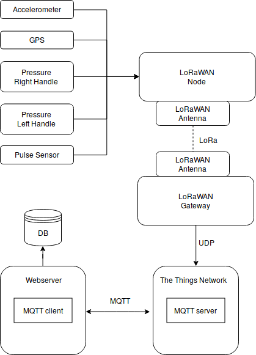

# LoRaWAN Walker Project

This repository contains code and documents belonging to the "Monitoring of Health Parameters using Smart Walkers" project done by Harshit Mahapatra, Patrick Lewandowski and Tomas Mota for the course "Building the Internet of Things with P2P and Cloud Computing" at Aarhus University.

The implemented architecture of the project is shown in the diagram:

